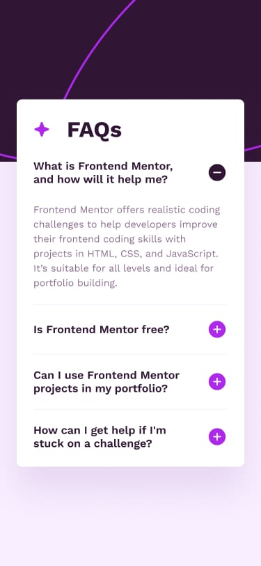

# Frontend Mentor - FAQ accordion solution

This is a solution to the [FAQ accordion challenge on Frontend Mentor](https://www.frontendmentor.io/challenges/faq-accordion-wyfFdeBwBz). Frontend Mentor challenges help you improve your coding skills by building realistic projects.

## Table of contents

- [Overview](#overview)
  - [The challenge](#the-challenge)
  - [Screenshot](#screenshot)
  - [Links](#links)
- [My process](#my-process)
  - [Built with](#built-with)
- [Author](#author)

## Overview

### The challenge

Users should be able to:

- See hover and focus states for all interactive elements on the page

### Screenshot

| Desktop version                                     |                   Mobile Version                   |
| --------------------------------------------------- | :------------------------------------------------: |
|  |  |

### Links

- Solution URL: [Solution URL here](https://github.com/mnsa2020/faq-accordion-main)
- Live Site URL: [Live Site URL here](https://mnsa2020.github.io/faq-accordion-main/)

## My process

### Built with

- Semantic HTML5 markup
- CSS custom properties
- Flexbox
- SASS
- JavaScript

## Author

- Website - [Mohamed Ahmed](https://github.com/mnsa2020)
- Frontend Mentor - [@mnsa2020](https://www.frontendmentor.io/profile/mnsa2020)
